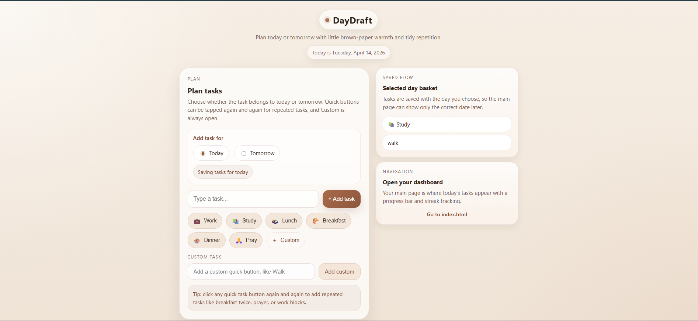
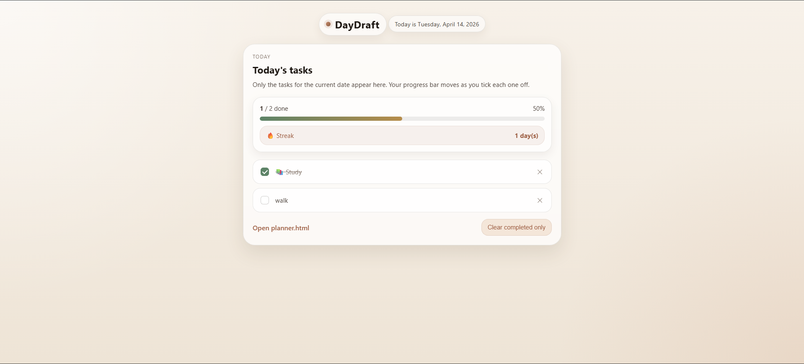
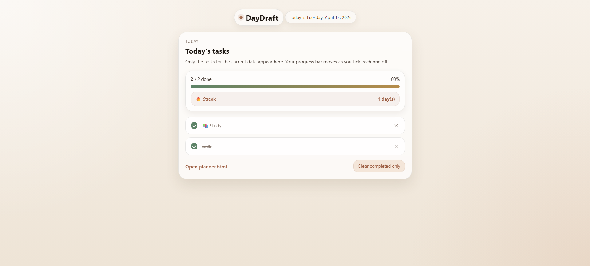
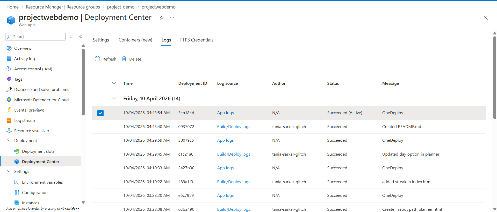
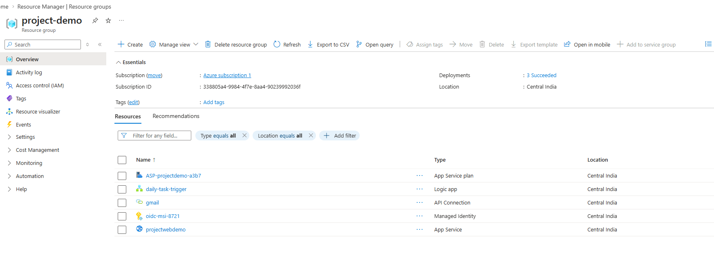
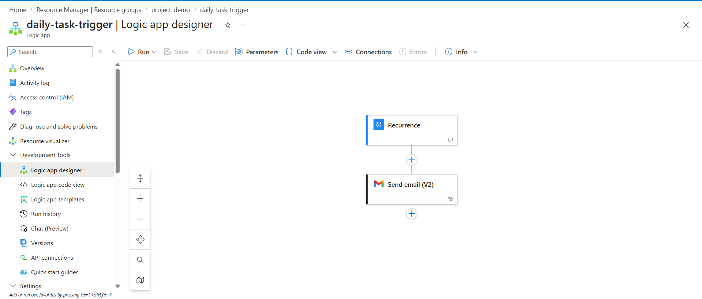
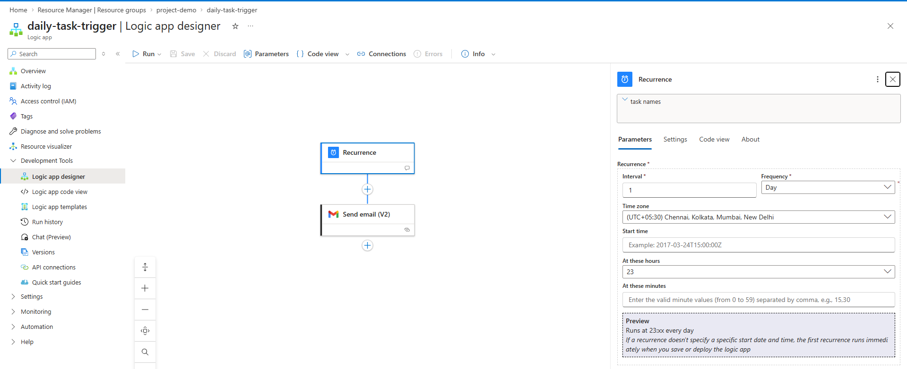
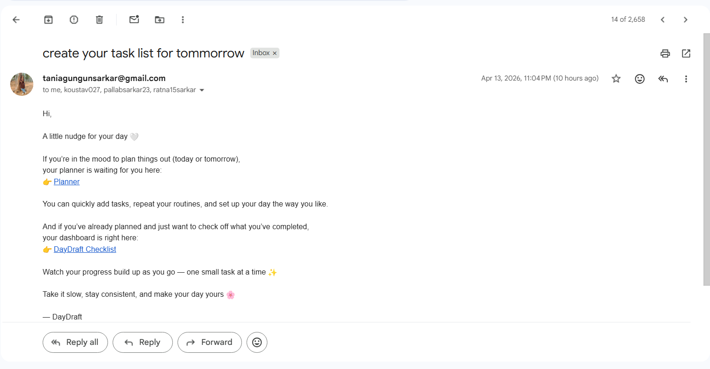

# DayDraft 🌿

Aesthetic daily task planner with progress tracking, streaks, and cloud-based automation.

---

## 🌐 Live Demo

- 🔗 Dashboard:  
  https://tania-sarkar-glitch.github.io/web-demo/

- 📝 Planner:  
  https://tania-sarkar-glitch.github.io/web-demo/planner.html

> ⚠️ Azure resources were decommissioned after the demonstration to avoid ongoing costs. Full proof of deployment and automation is provided below.

---

## ✨ Overview

DayDraft is a visually minimal task planner designed to simplify daily productivity through structured planning, progress tracking, and streak-based motivation.

---

## 🚀 Features

- Add tasks for today or tomorrow  
- Quick-add buttons (Work, Study, etc.)  
- Custom tasks  
- Progress bar tracking  
- Streak system  
- Email reminders via Azure Logic Apps (demo proof below)  
- Persistent storage using localStorage  

---

## 🧠 Tech Stack

- HTML, CSS, JavaScript  
- Azure App Service (Demo Phase)  
- Azure Logic Apps  
- GitHub Actions (CI/CD)  

---

## ⚙️ How It Works

1. Plan tasks via planner  
2. View tasks on dashboard  
3. Track progress  
4. Complete tasks → increase streak  
5. Azure Logic App sends scheduled reminders  

---

## 📸 Application Screens

---

## ☁️ Azure Deployment Proof

---

## 🔄 Automation Workflow (Logic Apps)

---

## ⚙️ CI/CD Pipeline

---

## 🎥 Demo Video

https://drive.google.com/file/d/1szJS_v7X8ziBeYPe1Hh5KaL9ywdyKW9v/view?usp=drive_link

---

## 📚 What I Learned

- Cloud deployment using Azure  
- Workflow automation with Logic Apps  
- CI/CD using GitHub Actions  
- Debugging real deployment issues  
- Building productivity-focused UI  

---

## 🚀 Future Scope

- Cloud database integration  
- Multi-device sync  
- Authentication  
- Dark mode  

---

## 🧾 Note

Azure resources were intentionally removed after testing to prevent unnecessary billing.  
All workflows and deployments are preserved via documentation and demo assets.

---

✨ Built with consistency, curiosity, and a lot of debugging.
